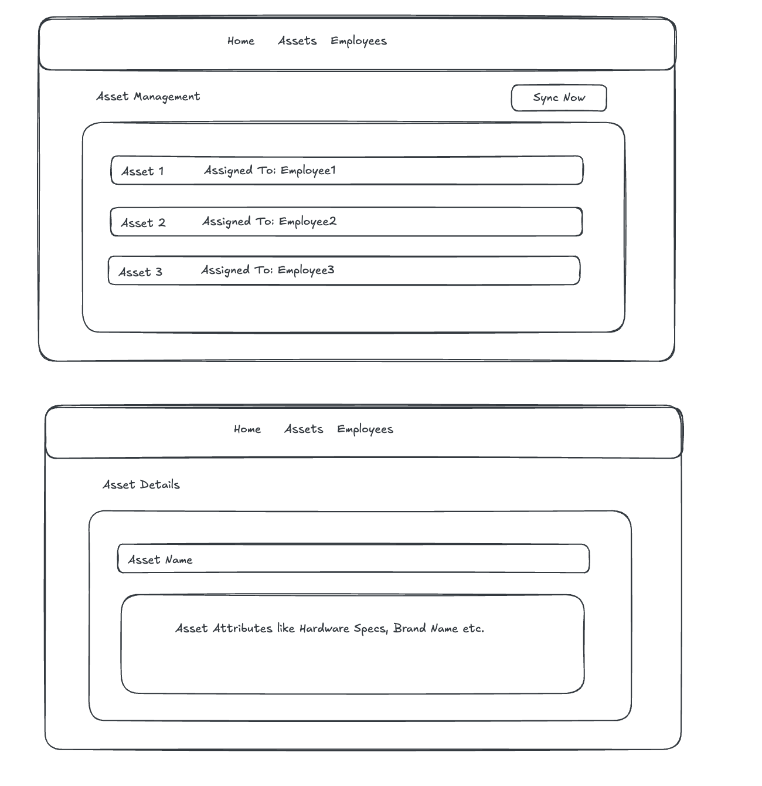

# Fullstack Assignment (6 hours): MDM Device Sync

## Context
WorkWize is an IT hardware management platform. Customers want to import **assigned devices** (devices that have a user) from MDM providers into WorkWize.  
Jamf is the only MDM provider in scope for this assignment, but also think how you can make it easier to implement future MDM providers.

---

## Key Definitions

- **Asset**  
  A device assigned to an employee. Only assigned devices are imported.

- **Asset Attributes**  
  Device specifications such as model, RAM, storage, etc.

- **Employee**  
  A user assigned to a device. Employees are uniquely identified by **email**.

---

## Goals
Create a new repository from this template for your Laravel + React project.

Please make sure the following GitHub users have access to the repository so we can review your work:

- @gumacs92
- @omarsh99

Refer to `.assignment/RefJamfSyncService.php` to understand the code structure and implement an improved version of `JamfSyncService` with enhancements. Use `api-mock-response.json` as the third-party API mock response. Refer **API Flow** section below.

Build a small **Laravel + React** application that can:

- Sync assigned devices from Jamf
- Store assets and employees in **MySQL**
- Show synced assets and employees in a UI list
- The frontend only requires **delete** functionality (no manual create or edit)
- Deleting an asset or employee removes it from the local database only
- Enforce the **MDM Sync Behaviour Rules** listed below

---

## API Flow

### Third-party Jamf API
For this assignment, use the provided mock response file:
- `.assignment/api-mock-response.json`

Your Laravel backend should read this JSON file directly when syncing devices.

### Laravel Backend API
Your React frontend should **not** read the JSON directly.  
Instead, it should interact with your Laravel backend through HTTP APIs.

The endpoints listed below are examples only. You are encouraged to design the API in a way that you think best fits a real-world application.

Example endpoint:

- `GET /api/assets`  
  Returns the synced assets for the UI list.

You may add, remove, or rename endpoints as you see fit. Feel free to introduce additional endpoints, request structures, or response formats if they improve clarity, flexibility, or correctness.

---

## MDM Sync Behaviour Rules

- Asset uniqueness is determined by **serial code**
- Employee uniqueness is determined by **email**
- Unassigned devices (no employee email) must not be imported
- After sync, device details must be visible in the assets list
- If an employee does not exist, it must be created
- Jamf is the source of truth for device assignments
- Re-running sync must recreate deleted assets or employees
- Any changes to device assignment or attributes in the mock response must be reflected after sync  
  _Example: RAM changes from 8GB to 16GB must be reflected after sync_
- Beyond the rules above, feel free to extend the sync logic with any additional behavior you believe is important in a production MDM sync flow (for example edge cases, data integrity, or resilience), and document your assumptions

---

## Running the Application

The application should be **dockerized** and runnable locally using Docker.

- Provide a `docker-compose.yml` that starts the backend, frontend, and MySQL
- The application should be runnable with a single command (for example: `docker compose up`)
- Include basic instructions in the README on how to start the app and access it in the browser
- No production-level setup is required, local development setup is sufficient

---

## Estimated Effort

⏱️ **This task typically takes around 6 hours of focused work**

You are not expected to productionize the setup, but the application should be runnable locally (preferably via Docker).

If you run out of time:
- Document what you would do next
- Call out known limitations or shortcuts
